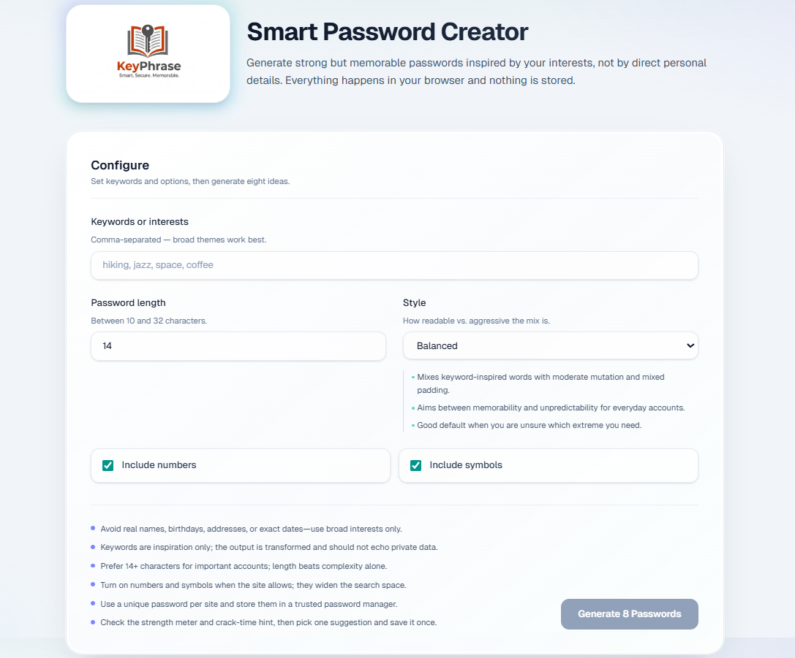

# KeyPhrase Password Generator

<p align="center">
  
</p>
A web app that transforms user interests into strong, memorable password suggestions.

**Smart. Secure. Memorable.**

[🚀 Live Demo](https://password-generator-plum-sigma-92.vercel.app/)

## Features

- Generate 8 password suggestions at once from interest keywords
- Multiple generation styles: `memorable`, `balanced`, `strongest`
- Adjustable password length (`10` to `32`)
- Optional number and symbol inclusion
- Integrated strength analysis via `@zxcvbn-ts` (score, label, crack-time estimates, stats)
- Client-side generation flow (no backend password storage)
- Built-in unit tests for generator rules and behavior

## Tech Stack

- [Next.js 16](https://nextjs.org/)
- React 19 + TypeScript
- Tailwind CSS 4
- `@zxcvbn-ts/core` + dictionaries
- [Vitest](https://vitest.dev/) for unit tests

## Getting Started

### 1) Install dependencies

```bash
npm install
```

### 2) Run development server

```bash
npm run dev
```

Open [http://localhost:3000](http://localhost:3000).

## Available Scripts

- `npm run dev` - start local development server
- `npm run build` - create production build
- `npm run start` - run built app
- `npm run lint` - run ESLint checks
- `npm test` - run unit tests with Vitest

## Testing

Unit tests cover generator invariants in `utils/passwordGenerator.test.ts`:

- length boundaries and clamping behavior
- charset behavior (numbers/symbols)
- uniqueness of generated suggestions
- style-specific behavior checks

Run tests:

```bash
npm test
```

## Security Notes

- Do not enter private personal data (full name, exact birth date, address, etc.) as keywords.
- Prefer unique passwords per site and save them in a trusted password manager.
- Enable 2FA for critical accounts.

## Project Structure (high level)

- `app/` - Next.js app router pages and global styles
- `components/` - UI components (generator, cards, meters, stats panel)
- `lib/` - zxcvbn loading/configuration and scoring helpers
- `types/` - shared TypeScript types
- `utils/` - password generation logic + tests
- `public/` - static assets (including logo)

## License

MIT
